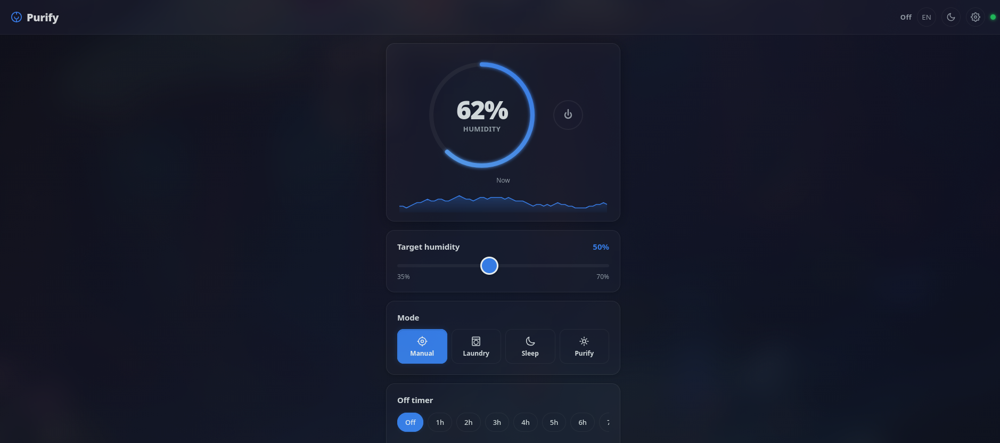

<div align="center">

# Purify

### Multi-device local control for Tuya appliances — no cloud required

[](https://github.com/kushiemoon-dev/purify-tuya/actions)
[](LICENSE)
[](https://python.org)
[](https://react.dev)



</div>

---

## Overview

**Purify** is a self-hosted PWA for controlling Tuya-based appliances (dehumidifiers, air purifiers) over your local network. No cloud account, no internet dependency — just direct LAN communication via the Tuya protocol.

Manage multiple devices from a single dashboard with real-time updates, automation rules, and room organisation.

---

## Features

- **Multi-device** — Add and control multiple Tuya devices from one dashboard
- **Driver architecture** — Dehumidifier and air purifier drivers with extensible plugin system
- **Automations** — Threshold-based rules with cooldowns (e.g. "turn on when humidity > 70%")
- **Rooms** — Group devices by location
- **Notifications** — Real-time alerts for faults, automations, and device events
- **History & charts** — Per-device metric history with configurable retention
- **Real-time WebSocket** — Live state pushed to all connected clients
- **React + TypeScript** — Modern frontend with Zustand state management
- **PWA offline** — Installable as a Progressive Web App
- **i18n** — French, English, and German
- **Mock mode** — Develop and demo without real hardware
- **Legacy API** — Single-device v0 API preserved for backward compatibility

---

## Quick Start

```bash
git clone https://github.com/kushiemoon-dev/purify-tuya.git
cd purify-tuya

# Backend
cd backend
python -m venv venv
source venv/bin/activate
pip install -r requirements.txt
cp .env.example .env   # configure your device (see below)

# Frontend (dev mode)
cd ../frontend
npm install
npm run dev

# Or production build
npm run build
cd ../backend
uvicorn main:app --host 127.0.0.1 --port 8000
```

Open **http://localhost:8000/purify/** in your browser.

---

## Configuration

Settings are read from environment variables or a `.env` file in `backend/`.

| Variable | Default | Description |
|----------|---------|-------------|
| `DEVICE_ID` | _(required)_ | Tuya device ID (legacy single-device) |
| `DEVICE_IP` | _(required)_ | Device IP on your LAN |
| `LOCAL_KEY` | _(required)_ | Tuya local encryption key |
| `POLL_INTERVAL` | `5` | Seconds between device polls |
| `MOCK_DEVICE` | `true` | Use simulated device (no hardware needed) |

Additional devices are managed via the UI or the v1 REST API.

To obtain your Tuya credentials, follow the [tinytuya setup guide](https://github.com/jasonacox/tinytuya#setup).

---

## Architecture

```
React SPA (PWA)              FastAPI backend
┌─────────────┐         ┌──────────────────────┐
│  Zustand     │◄──ws──►│  WebSocket manager    │
│  stores      │        │                       │
│  components  │──http──►│  v1 REST API          │
└─────────────┘         │    /devices            │
                        │    /rooms              │
                        │    /automations        │
                        │    /notifications      │
                        │    /history            │
                        │                       │
                        │  Device Manager        │
                        │    ├─ Dehumidifier     │
                        │    └─ Air Purifier     │
                        │                       │
                        │  Automation Engine     │
                        │  SQLite (async)        │
                        └──────────┬─────────────┘
                                   │ LAN
                              Tuya Devices
                            (protocol v3.3)
```

---

## API

### v1 API (multi-device)

| Method | Endpoint | Description |
|--------|----------|-------------|
| `GET` | `/purify/api/v1/devices` | List all devices |
| `POST` | `/purify/api/v1/devices` | Add a device |
| `GET` | `/purify/api/v1/devices/:id/state` | Device state |
| `POST` | `/purify/api/v1/devices/:id/command` | Send command |
| `GET` | `/purify/api/v1/devices/:id/capabilities` | Driver capabilities |
| `GET/POST` | `/purify/api/v1/rooms` | Room management |
| `GET/POST` | `/purify/api/v1/automations` | Automation rules |
| `GET` | `/purify/api/v1/notifications` | Notification feed |
| `GET` | `/purify/api/v1/devices/:id/history` | Metric history |
| `WS` | `/purify/ws` | Real-time updates |

### Legacy API (single-device)

| Method | Endpoint | Description |
|--------|----------|-------------|
| `GET` | `/purify/api/state` | Current device state |
| `POST` | `/purify/api/power` | Toggle power |
| `POST` | `/purify/api/humidity` | Set target humidity |
| `POST` | `/purify/api/mode` | Set mode |

---

## Testing

```bash
# Backend (149 tests)
cd backend && pytest tests/ -v --cov=services --cov=drivers --cov=api

# Frontend (28 tests)
cd frontend && npx vitest run
```

---

## Deployment

### systemd

```bash
sudo cp purify.service /etc/systemd/system/
sudo systemctl enable --now purify
```

### Apache Reverse Proxy

```bash
sudo cp deploy/purify-apache.conf /etc/httpd/conf/conf.d/purify.conf
sudo systemctl reload httpd
```

Requires `mod_proxy`, `mod_proxy_http`, and `mod_proxy_wstunnel`.

---

## Tech Stack

**Backend:** FastAPI, SQLAlchemy (async), tinytuya, Alembic, Pydantic
**Frontend:** React 18, TypeScript, Vite, Zustand, Recharts, Tailwind CSS
**Testing:** pytest, pytest-asyncio, Vitest, Testing Library
**CI:** GitHub Actions (4 parallel jobs)

---

## Credits

- [tinytuya](https://github.com/jasonacox/tinytuya) — Local Tuya device communication
- [FastAPI](https://fastapi.tiangolo.com) — Python web framework
- [React](https://react.dev) — UI library
- [Vite](https://vitejs.dev) — Frontend build tool

---

## Disclaimer

Purify is not affiliated with, endorsed by, or connected to Tuya or any device manufacturer. Use at your own risk.

---

<div align="center">

**MIT License** · [Releases](https://github.com/kushiemoon-dev/purify-tuya/releases) · [Issues](https://github.com/kushiemoon-dev/purify-tuya/issues)

</div>
